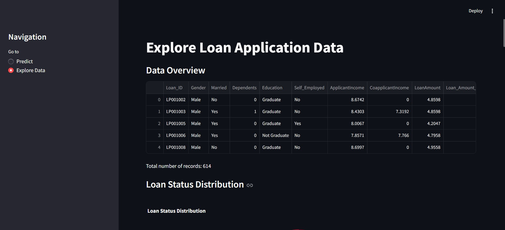
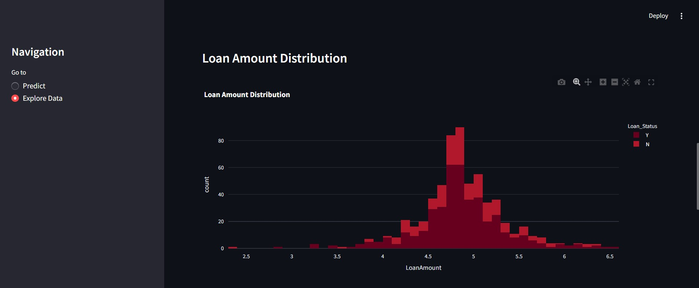
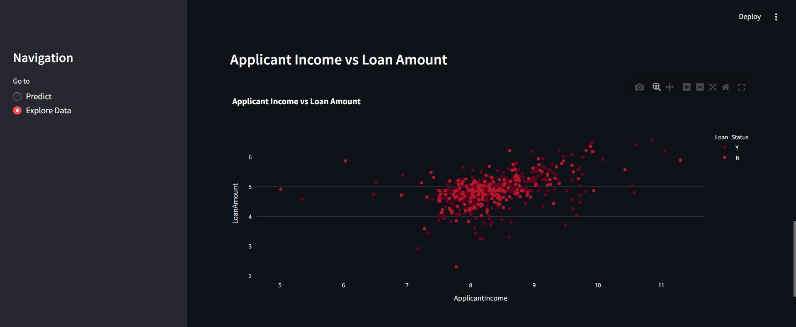
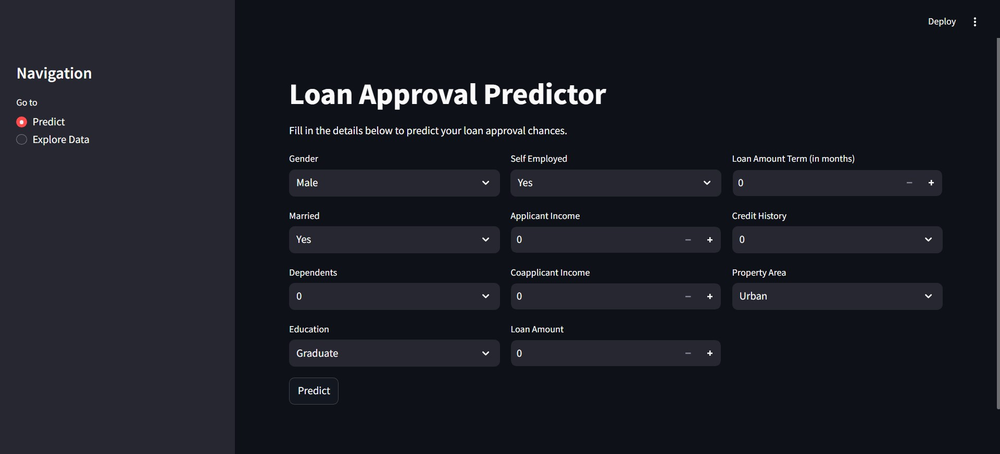
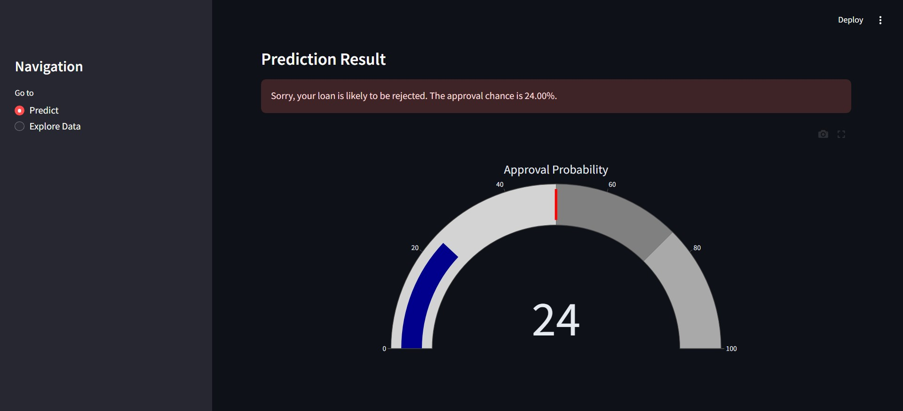

# Loan Approval Prediction App

This is a machine learning project developed by Monali and Jayash Bhardwaj as a final group project for our internship at Hoping Minds. The project aims to predict loan approval based on various applicant features using a Random Forest Classifier.

## Features

The project offers the following features:

* **Loan Approval Prediction:** Predicts the likelihood of loan approval based on user-provided input.
* **Interactive Data Exploration:** Allows users to explore and visualize the loan application data through interactive charts and graphs.
* **User-Friendly Interface:** Provides a simple and intuitive interface built with Streamlit for easy interaction and understanding.
* **Data Preprocessing:** Includes data cleaning, handling missing values, and feature engineering for optimal model performance.
* **Model Training and Evaluation:** Utilizes a Random Forest Classifier trained on a preprocessed dataset for accurate predictions.
* **Visualization of Prediction Probability:** Displays the approval probability using an interactive gauge chart for better visualization.

## Installation

1. Clone the repository: `git clone https://github.com/jayash1973/Advanced-Loan-Predictor`
2. Install the required packages: `pip install -r requirements.txt`

## Usage

1. Run the app: `streamlit run app.py`
2. Navigate to the app in your web browser (usually `http://localhost:8501`).
3. Use the sidebar to choose between "Predict" and "Explore Data" modes.

**Predict Mode:**

* Fill in the required applicant information in the provided fields.
* Click the "Predict" button to get the loan approval prediction and probability.

**Explore Data Mode:**

* Explore various visualizations and insights from the loan application data, including:
    * Loan Status Distribution
    * Correlation Heatmap
    * Loan Amount Distribution
    * Applicant Income vs Loan Amount
    * Loan Status by Education and Credit History

    

    

    

## Data

The project uses a loan application dataset (`train.csv`) for training and prediction. The dataset contains various features such as gender, marital status, education, income, loan amount, and credit history.

## Model

The prediction model is a Random Forest Classifier, chosen for its robustness and ability to handle complex relationships within the data.

## Live Demo

You can test this project live at: [https://huggingface.co/spaces/Johan713/Advanced-Loan-Predictor](https://huggingface.co/spaces/Johan713/Advanced-Loan-Predictor)

***screenshots***

## Contributing

Contributions are welcome! Please feel free to submit issues or pull requests.

## Authors

* **Monali**

* **Jayash Bhardwaj**

## Acknowledgments

* Hoping Minds for providing the opportunity and mentorship for this project.

## License

This project is licensed under the MIT License.

## Contact Details

**Jayash Bhardwaj**

**Monali**

